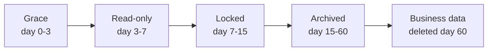
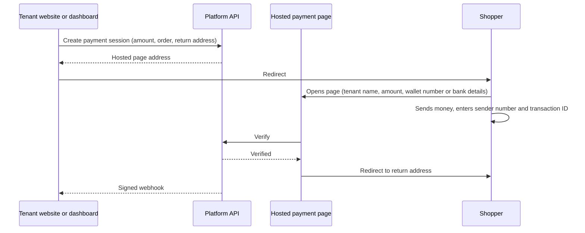

# Lytronix Multi-Tenant Commerce Platform — Software Requirements Specification

As of 2026-09-25

## 1. Introduction

This document specifies a multi-tenant order-management and commerce back end that Lytronix will operate for many independent sellers (tenants), sold as monthly subscriptions.

**Purpose.** It defines what the platform must do, how it is priced and limited, and how it is run, so it can be built and operated by one person now and by a team later.

**Scope.** In scope: the tenant dashboard, the public API, hosted payment page, courier and fraud-check integrations, SMS, chat and AI features, billing and plan lifecycle, metering, and platform administration. Out of scope: a customer-facing storefront (tenants build their own and call the API), and holding or moving customers' money.

**Starting point.** A single-tenant implementation already exists (Express, MongoDB, React admin and storefront apps, Steadfast courier, bKash payments, SMS listener, chat with AI, push notifications). This SRS describes the multi-tenant product built from it. The multi-tenant product uses PostgreSQL instead of MongoDB, so the data layer is rewritten and the existing store is migrated in as the first tenant (see DAT-1 to DAT-6).

**Terms used**

| Term | Meaning |
| --- | --- |
| Tenant | A subscribing business with its own data, staff and settings |
| Subscriber | The tenant's owner account; it outlives the tenant's business data |
| Staff | Users a tenant creates under its plan's seat limit |
| Shopper | A tenant's customer who buys through the tenant's own website |
| Plan | Starter, Growth or Pro: a priced bundle of limits and features |
| Snapshot | The plan's values frozen at the moment of purchase |
| Balance | The tenant's prepaid money for SMS, chat AI and other metered use |
| Hosted payment page | A page on the platform where a shopper pays the tenant's wallet number |
| Public key / secret key | API keys for browser use and for server use respectively |
| Essential SMS | Login OTP and staff password-reset messages |

## 2. Product overview

The platform gives each tenant a dashboard, an API, and a shared, tenant-branded storefront to run orders, payments, couriers and customer messaging.

**Who it serves.** Every tenant gets a working online shop out of the box — the shared storefront — including sellers who take orders on Facebook, WhatsApp or by phone with no website of their own. A tenant with an existing website may switch the shared storefront off and use only the API, the way an agency-built site already would.

**What a tenant gets.** An admin dashboard (installable PWA), a shared shopper-facing storefront (installable PWA of its own) included at no extra cost, their own staff accounts, product and order management, media storage, courier booking with their own courier credentials, fraud checks, SMS, chat, a hosted payment page, and API access, all on a monthly, 3-month, 6-month or yearly plan.

**Storefront.** Served at the tenant's subdomain or custom domain root, with the dashboard at `/admin` on the same host. It is one shared application configured per tenant (branding, catalogue, enabled payment methods) — no per-tenant custom code. Its design is built fresh, to a professional visual standard, and does not reuse or derive from the single-tenant app's storefront pages, which are a different codebase built for a different purpose. Checkout creates an order through the same public-key API an external site would use, and hands off to the existing hosted payment page for online payment, so the storefront adds no new payment or verification logic of its own. A tenant with its own website can switch it off without losing any data. The product page and cart show an estimated delivery charge, using the same calculation as the real order (never a separate approximation), against the current cart and the shopper's chosen district once known — no sign-in required. Because catalogue reads, image serving and order creation already run through the platform's own API and R2-backed media regardless of who hosts the shop's pages, the storefront adds comparatively little new infrastructure cost on top of what section 16 already budgets for that traffic — it mainly adds cheap, edge-cached page hosting on top.

**Business model.** A fixed plan fee covers the platform and set allowances. SMS, chat AI, fraud checks and similar per-use costs are paid from a prepaid balance. Anything that costs the tenant money on their own accounts (courier fees, wallet fees) is paid by the tenant directly to that provider.

**Design decisions fixed in this document**

- Open sign-up for everyone; support is self-service first, run by one person.
- Every plan parameter is editable data, not code.
- Money for shopper payments never passes through the platform.
- Limits block new activity; they never delete existing data without notice.
- Prepaid balance is a tenant asset: it can be frozen, never confiscated.

**Constraints**

- One operator for support, at least at launch.
- Renewals are manual prepaid payments (bKash, Nagad or balance); card auto-renewal is not assumed.
- Free-tier AI quotas are too small for many tenants, so chat AI and extraction use a paid tier billed through the balance.
- Courier and payment integrations depend on third-party APIs that can change.

## 3. Tenants, accounts and activity log

Every record belongs to exactly one tenant, and a tenant's data is never visible to another tenant.

**Requirements**

- **TEN-1 Isolation.** Every business table carries a tenant ID. The tenant comes from the session or API key, never from a request field. Every query filters on it, and PostgreSQL row-level security enforces it as a second barrier.
- **TEN-2 Sign-up.** Anyone can sign up, verifying through exactly one of: phone (SMS one-time code), email (a one-time code or link), or Google/Facebook sign-in. A password is required unless the account was created through Google or Facebook. These three identity channels are deliberately never cross-checked against each other — including a Facebook-verified account even where Facebook happens to report an email already used by a separate email-verified account — so **a person may intentionally hold up to three tenants, one per channel** (TEN-15, OD-53); this is platform policy, not a gap. Free trials are limited per verified identity and per device/IP, so the same allowance applies per channel. A subscriber can add a second or third verified identity to the same account afterward, but can't remove their last remaining one. Account recovery and system notices use whatever identity exists — SMS for a verified phone, email for a verified email; a Facebook-only account with no email shared has no recovery path besides signing in with that same Facebook account again, and is told so plainly at sign-up.
- **TEN-3 Subscriber account.** The subscriber account (login, phone, email, plan and payment history, invoices) is separate from the tenant's business data and survives business-data deletion.
- **TEN-4 Owner and staff.** The owner creates staff under the plan's seat limit. Only active staff count toward the limit; deactivating frees a seat and keeps history.
- **TEN-5 Roles and permissions.** Tenants define roles from the platform's permission list (for example orders:manage). Roles are not capped. The same permission names authorise both dashboard users and API key scopes.
- **TEN-6 Seat enforcement.** The server refuses creating or reactivating a user above the limit with a clear message. A downgrade never deletes staff: the owner chooses which stay active.
- **TEN-6b Native apps.** In addition to each tenant's own installable PWA, the dashboard is also published as one shared native Android app — one Play Store listing for every subscriber, not one per tenant, built as a separate native application (React Native) rather than a wrapped PWA, so it can be given a genuinely native feel and native device features over time; it consumes the same dashboard API as the web app, is tracked for feature parity rather than assumed to match it, and sends push through the platform's own notification service. The storefront's native-app experience is its installable PWA, free for every tenant — that is the whole of it. A dedicated, separately Play-Store-listed native app for one tenant's own storefront is not offered at all, since a native listing per tenant does not scale to a self-service model with many tenants.
- **TEN-6a Operator as tenant.** At most one tenant per verified identity channel, unchanged. The platform operator may separately hold a subscriber account and run their own business on the platform, exactly like anyone else: same sign-up, trial, plan and billing, no built-in special treatment. Any special limit for the operator’s own tenant uses the same logged per-tenant override any tenant could receive (PLN-11). View-as-tenant (ADM-4) applies to the operator’s own tenant exactly as it would to any other — a ticket reference, read-only, logged — so there is no unaudited backdoor into it.
- **TEN-7 Store address.** Each tenant gets a subdomain (for example name.lytronix.shop): the storefront at its root, the dashboard at /admin. Growth and Pro tenants may use a custom domain the same way, also usable as the API host. The subdomain is derived from the shop name and must be unique — a name collision (two tenants both called "Fashion House") gets a numeric suffix (fashion-house, fashion-house-2, ...), shown to the owner before sign-up completes. Only the URL needs to be unique; the display name shown inside the dashboard and storefront does not, and can match another tenant's exactly. The subdomain is generated exactly once, at creation, and is permanent — no action, including later renaming the shop (TEN-8), ever changes it.
- **TEN-7a Resolving the tenant from the address.** For public traffic the tenant is derived from the request's hostname alone, as the very first step: the platform subdomain's left label is looked up as the slug, and any other host is looked up among verified, active custom domains. Nothing the client sends (a parameter or header) can select a tenant. An unknown, pending or removed host returns not-found and never falls back to a default tenant; a suspended or archived tenant shows its closed page. Reserved names (www, api, admin and similar) can never be a slug. The lookup is cached briefly and invalidated within seconds of a domain or status change. The host is trusted only when set by Cloudflare (direct-to-origin requests are refused); a signed-in session's tenant must match the host's tenant or the request is rejected; cookies are scoped to the exact hostname; payment pages and callbacks identify the tenant by a signed identifier, not the host.
- **TEN-8 Dashboard branding.** The dashboard shows the tenant's own shop name and an optional uploaded logo in its navigation, tab title and installed PWA (icon, name, splash) — not Lytronix's — so a tenant's staff see their own shop's identity in the tool they use daily, matching the custom domain Growth/Pro already pay for. A small, non-removable "Powered by Lytronix" mark stays, both as attribution and as a trust signal against phishing lookalikes.

**Activity log (audit log)**

- **AUD-1** Records who did what and when, per tenant: sign-ins, order and status changes, payment verification, wallet-number and credential changes, API key use, staff changes, plan changes. Never passwords or secrets.
- **AUD-2** The tenant owner (and staff given the permission) can read the tenant's own log on an Activity page. Platform operators can read all tenants' logs. No one can edit or delete entries.
- **AUD-3** Retention is set per plan and editable. Money-related entries are kept longer than the rest.

## 4. Plans, pricing and billing periods

There are three plans at 449, 699 and 999 TK per month (Starter lowered 2026-10-02 from 499), sold for 1, 3, 6 or 12 months at launch, and every value below, including which billing terms exist, is editable data.

**Plan sheet.** Values marked † were proposed during design and are starting points to confirm; the rest were decided.

| | Starter | Growth | Pro |
| --- | --- | --- | --- |
| Price per month (TK) | 449 | 699 | 999 |
| Media storage | 2 GB | 4 GB | 8 GB |
| Media bandwidth per month | 30 GB | 100 GB | 300 GB |
| API access | included | included | included |
| Hosted payment page | included | included | included |
| Paired listener devices † | 1 | 2 | 5 |
| Custom domain | no | yes | yes |
| Chat AI auto-reply † | no | yes | yes |
| Couriers | tenant's own credentials, no cap | same | same |
| Free essential SMS per month | 10 | 15 | 20 |
| Products † | 100 | 1,000 | 5,000 |
| Order handling per month † (courier booking or marking shipped; creation is unlimited) | 300 | 1,500 | 6,000 |
| Order handling per day † | 60 | 300 | 1,000 |
| Staff seats † | 2 | 5 | 15 |
| Activity log and chat retention † | 30 days | 90 days | 365 days |
| Support † | ticket, 2 business days | ticket, next day | priority, same day |

**Billing terms and prices (TK).** These four terms are the launch set. Terms are data (see PLN-7): the operator can add or retire a term at any time. Discounts are 5% for 3 months, 8% for 6 months and 12% for a year.

| | Monthly | 3 months | 6 months | 12 months |
| --- | --- | --- | --- | --- |
| Starter | 449 | 1,280 | 2,478 | 4,741 |
| Growth | 699 | 1,992 | 3,858 | 7,381 |
| Pro | 999 | 2,847 | 5,514 | 10,549 |

**Free trial.** 30 days (one month, extended 2026-10-02 from the original 7 days), phone-verified, no payment method. Limits (raised 2026-10-02 to match): 40 orders, 20 products, 1 staff, 1 paired listener device, 200 MB storage, 5 GB bandwidth, and 8 essential SMS in total. Trial tenants cannot top up or spend a balance. There is no separate ongoing free tier beyond this: at day 30, a tenant who hasn't subscribed automatically becomes a pay-as-you-go tenant (its real, permanent free tier, 0 TK/month) rather than being treated as a lapsed subscriber — the grace/read-only/locked/archived lifecycle applies only to a subscriber who stops paying an existing commitment, never to someone who simply never subscribed. All trial data carries over unchanged, and its tight limits widen to pay-as-you-go's the moment it happens.

**Requirements**

- **PLN-1 Plans as data.** A plan record holds its name, rank, a price for each billing term enabled for it, every numeric limit, every feature switch and whether it is offered for sale. Per-use rates and lifecycle days are platform settings, not part of a plan (see the pay-per-use rules in section 6 and LIF-6). A super-admin screen edits it.
- **PLN-2 Snapshot.** Every purchase (first purchase, renewal, upgrade, re-purchase after a lapse) stores a snapshot of the plan's limits, features and price at that moment. Editing a plan never changes a period already paid for.
- **PLN-3 Renewal price.** A renewal buys the plan as it is then. The tenant must be shown the price before paying.
- **PLN-4 Payment.** Plans are prepaid for the chosen period by bKash, Nagad or balance. A plan takes effect only after the payment is confirmed.
- **PLN-5 Invoices.** Each payment produces an invoice with the plan, period and tax shown when the business is tax-registered.
- **PLN-6 Not-for-sale plans.** The operator can create any number of not-for-sale plan records — an enterprise ("contact us") tier for custom deals, and an internal tier for the operator’s own or other special-purpose tenants, for example — and assign one directly to a tenant with no payment step: it activates immediately with a normal snapshot, so every limit and lifecycle rule works exactly as it would for a purchased plan. The operator chooses a renewing period or no expiry at all; either way a reason is required and the assignment is audited. A not-for-sale plan never appears in any plan list a tenant sees, enforced in the API itself, not just hidden in the interface. A tenant on a no-expiry internal plan is never prompted to renew and never lapses.
- **PLN-7a Pay-as-you-go.** A tenant may choose pay-as-you-go instead of a subscription: no monthly fee, no billing term, no period to lapse. An order's platform fee is charged only when the tenant's own staff take a fulfillment action on it — booking a courier, or marking it shipped by hand — never at order creation, so a shopper (or a spammer) creating an order never touches the tenant's balance. The fee is the greater of a fixed minimum (proposed 20 TK) and a percentage of the order's total (proposed 1.5%) at that moment, both editable platform rates. Booking is refused if the balance can't cover the fee, leaving the order unbooked; the fee is not refunded for a later cancellation of an already-booked order, and an order never booked is never charged at all. There is no monthly order-count limit — volume is controlled by balance and the normal per-minute limits. Its resource limits sit below Starter's on every axis (1 seat, 25-product ceiling, 250 MB storage, 10 GB bandwidth, 100,000 requests a cycle, the first four now decided), not equal to them, since none of those resources are separately metered for pay-as-you-go and an equal ceiling would let a tenant run a real shop at Starter's resource level for free. Products also carry no free allowance: creating one charges the balance a fixed fee (proposed 10 TK) once, regardless of variants, refused if the balance can't cover it, with the ceiling above still applying. Since it has no billing period, bandwidth, request and session counters instead reset on a rolling calendar-month cycle from the tenant's creation date. Its new-tenant payment-volume cap is on by default (stricter than the optional cap other tenants get), and it has no custom domain. It never lapses through grace/read-only/locked automatically; closing it (voluntarily or by the operator) goes straight to archived, then deletion at day 60, the same as any other tenant's data. Switching a subscription tenant to pay-as-you-go follows the downgrade timing (end of period); switching the other way is a fresh purchase, with no prorated credit.
- **PLN-7 Billing terms are data.** A billing term is a record (label, length in calendar months, visible flag, display order, optional default discount). The operator can add a term or retire one at any time with no code change. Retiring a term stops it being offered for new purchases and renewals but changes nothing for subscriptions already on it. A term used by any snapshot cannot be deleted, only retired. Reminders, grace, lifecycle dates and upgrade credit use the start and end dates stored with each purchase, never the current term list. A plan may offer any subset of terms; per-plan, per-term prices are stored explicitly (the discount only pre-fills them).
- **PLN-8 Plan rank.** Plans have a unique rank among plans for sale; moving to a higher rank is an upgrade and to a lower rank is a downgrade, so the rule does not depend on which billing terms exist.

## 5. Plan changes, cancellation and expiry

Upgrades start immediately and restart the billing cycle, downgrades wait for the end of the paid period, and a lapsed subscription passes through fixed stages before business data is deleted after 60 days.

### 5.1 Upgrade (cycle restarts)

- **UPG-1** The new plan starts as soon as payment is confirmed.
- **UPG-2** The tenant gets credit for the unused part of the current plan, prorated by the day and rounded to whole taka. They pay the new plan's full price for the chosen period minus that credit. The billing cycle restarts on the upgrade day and the renewal date moves.
- **UPG-3** Usage counters (orders, free essential SMS, bandwidth, requests) reset with the new cycle.
- **UPG-4** Add-ons and extra packs bought earlier stay until their own end.
- **UPG-5** The screen shows the exact amount and the new renewal date before the tenant confirms.

Example: Starter (449 TK, 30 days) upgrades to Growth (699 TK) on day 11, with 20 days left. Credit is 449 × 20/30 = 299 TK. The tenant pays 699 − 299 = 400 TK, and Growth runs for 30 days from that day.

### 5.2 Downgrade (end of paid period)

- **DWN-1** A downgrade takes effect at the end of the current paid period. Nothing changes and nothing is refunded before then.
- **DWN-2** The tenant sees a preview listing every limit they will exceed. They can cancel the scheduled downgrade at any time before it starts; buying an upgrade cancels it automatically.
- **DWN-3** Rule: block new items above the new limit, never delete or hide existing ones suddenly.
- **DWN-4** The tenant has 30 days after the downgrade to get under the limits. During that time everything keeps working and a banner counts down. Afterwards new items stay blocked; nothing is deleted without warning and an export offer.

| Limit exceeded | Behaviour |
| --- | --- |
| Products | Existing products stay visible and sellable; adding new ones is blocked |
| Staff seats | The owner chooses who stays active; others are deactivated, not deleted |
| Storage | Existing media stays live; new uploads are blocked |
| API access | Not applicable: all plans include it; request limits change |
| Custom domain | Removed at the end of the period unless the plan keeps it |
| Retention | Shorter retention applies at the next cleanup, after advance warning |

### 5.3 Cancellation and expiry lifecycle

A subscription that is cancelled, or is not renewed, moves through these stages. Days count from the end of the paid period.

| Stage | Days | Tenant dashboard | Public side | Balance |
| --- | --- | --- | --- | --- |
| Grace | 0–3 | Fully working, renewal reminders | Working | Usable |
| Read-only | 3–7 | Owner and staff can view and export; nothing can be created or changed | Public API, hosted payment page and store address fully offline | Frozen |
| Locked | 7–15 | Owner only, to renew or export | Offline | Frozen |
| Archived | 15–60 | Off; data kept | Offline | Frozen |
| Deleted | day 60 | Business data permanently deleted | Offline | Frozen |

- **LIF-1** Buying a plan at any stage before deletion restores the tenant's data and services exactly as they were.
- **LIF-2** Deletion removes business data only (products, orders, customers, media, chat, settings). The subscriber account, its plan and payment history, invoices and the deletion record remain.
- **LIF-3** Before deletion the owner receives at least two warnings by SMS or email and an offer to export everything.
- **LIF-4** Cancelling keeps access until the paid period ends, then follows the same stages. A missed renewal follows the same path.
- **LIF-5** No refund is given for a period that has started, including a tenant's first purchase — decided; the one-month (30-day) free trial is the evaluation window, not the paid period.
- **LIF-6** The stage lengths (grace 3, read-only to day 7, locked to day 15, archived to day 60) are platform settings. A change applies only to subscription periods that end after the change; a tenant already in a lapsed stage keeps the schedule it started with. (Decided.)

### 5.4 Prepaid balance rule

The whole rule is one line: **a balance is active until the grace period ends.**

- **BAL-1** While a plan is active, including its grace days (3 by default), the balance can be spent.
- **BAL-2** When grace ends the balance is frozen: no spending. It is never deleted or refunded; it is the subscriber's asset.
- **BAL-3** Buying a plan again makes the balance usable again. There are no per-top-up expiry dates.
- **BAL-4** Top-ups are offered only while a plan is active.

## 6. Metered limits

Storage, media bandwidth, API requests and payment sessions have strict per-plan limits enforced on the server; SMS and AI have no cap but are paid from the balance.

**Enforcement pattern (all metered limits).** The tenant sees usage against the limit in the dashboard. Warnings at 50%, 80% and 95%. At 100% the action is refused (a `429` for API and media requests). A tenant may opt in to extra packs bought from the balance; without opt-in it is a hard stop. Counters reset at the start of each billing period. A shop is never taken down entirely by a limit.

**Storage.** Counts everything the tenant stores: originals, generated thumbnails, chat media and payment-proof images. At 100% new uploads are refused; existing files stay live.

| Plan | Storage | Approx. images (250 KB each) | Approx. video (720p, 12 MB/min) |
| --- | --- | --- | --- |
| Trial | 200 MB | 800 | 16 min |
| Starter | 2 GB | 8,000 | 2.8 h |
| Growth | 4 GB | 16,000 | 5.6 h |
| Pro | 8 GB | 32,000 | 11 h |

- **STO-1** Images are compressed and resized on upload. Per-file limits: 5 MB per image, 100 MB per video (editable).
- **STO-2** Media is stored in Cloudflare R2 under a per-tenant path. There is no separate backup copy of media (decided); its durability relies on R2.

**Media bandwidth.** Counts bytes of media delivered from the platform to visitors, per tenant and billing period.

- **BND-1** Media is served from its own address through a Cloudflare Worker that counts every request and its bytes per tenant, checks the tenant's state and quota, looks in the cache, and reads R2 only on a miss.
- **BND-2** Limits: Starter 30 GB, Growth 100 GB, Pro 300 GB per month. At 100% media requests are refused unless the tenant opted in to extra bandwidth packs (starting price 30 TK per 10 GB).
- **BND-3** Usage is aggregated about once a minute and a blocked-tenant list is refreshed at the same rate; a small overshoot is acceptable.
- **BND-4** Private media (payment proofs, chat media) use signed, expiring links; public product images have stable, content-hashed links. Cloudflare's own cache is never placed in front of the Worker, so counting stays accurate.

**Media on Cloudflare R2 (decided).**

- **MED-1** All tenant media lives in Cloudflare R2 under a per-tenant prefix; the Worker refuses any request for another tenant's prefix.
- **MED-2** Uploads are signed direct uploads to a temporary area, then validated, resized and moved to the tenant's prefix by a processing job; a failed check deletes the file and it never counts as stored.
- **MED-3** Storage usage is kept as a database row per object and reconciled daily against R2, so limits never depend on slow bucket listings.
- **MED-4** Access keys are least-privilege and rotated every 90 days; the public-serving Worker can only read, and only a separate deletion-job key can delete objects.
- **MED-5** Accepted risk: media has no separate backup. R2 protects against hardware loss (stated eleven-nines durability) but not against deletion, a compromised key or a Cloudflare account problem. The terms of service say so, and the Cloudflare account is secured with two-factor authentication and a minimum number of members.

**API rate limits (all editable).**

| | Starter | Growth | Pro |
| --- | --- | --- | --- |
| Requests per minute, public key | 60 | 180 | 600 |
| Requests per minute, secret key | 120 | 360 | 1,200 |
| Requests per month | 200,000 | 600,000 | 2,000,000 |
| Order creations per minute | 10 | 30 | 60 |
| Payment sessions per minute | 10 | 30 | 60 |
| Payment sessions per month (independent of the order-handling limit above) | 600 | 3,000 | 12,000 |

- **RTE-1** Limits are checked before any cache, and cached responses count. Every response carries headers showing the remaining allowance; over-limit responses carry `Retry-After`.
- **RTE-2** Public keys have extra limits per visitor IP (for example 10 order creations and 5 OTP requests per minute) and accept calls only from the tenant's registered website addresses.
- **RTE-3** Dashboard sign-in traffic and API keys use separate limit buckets, so an integration can never lock the owner out.
- **RTE-4** Optional request packs (starting price 20 TK per 100,000 requests) follow the same opt-in rule.

**Pay per use.** SMS, chat AI replies, AI order extraction and fraud checks are charged from the balance at platform-wide rates that follow the operator's current cost.

- **RAT-1** Rates are platform settings, not part of a plan, and are edited only by the operator.
- **RAT-2** A rate change takes effect immediately for every tenant's future charges. The system requires no notice period.
- **RAT-3** Each balance charge stores the units and the rate used, so past entries never change when a rate changes.
- **RAT-4** A "current rates" page in the dashboard shows each rate and the time it took effect; the operator can see the full history.
- **RAT-5** Each rate change prompts the operator to publish a prefilled rate-change notice on the notice board (see ADM-6).

## 7. Commerce functions

These functions already exist in the single-tenant product and carry over per tenant; the new requirement is tenant scoping and plan limits on each.

**Products and media**

- **PRD-1** Tenants manage categories and products (name, price, stock, images, video, delivery charge, active flag) up to the plan's product limit.
- **PRD-1a Delivery-charge mode.** Each product (or variant) has an optional weight and a delivery-charge mode, Default or Adjustable. Entering a weight pre-selects Adjustable; leaving it blank forces Default. **Default:** `(unit price + delivery charge) × quantity` — every unit priced independently. **Adjustable:** `(unit price × quantity) + one delivery charge for the line's combined weight` — using the product's own delivery charge as the first-kilogram rate and one shop-wide extra-per-kg rate beyond that. Each cart line is computed independently by its own mode — nothing is combined across different products — and which courier eventually books the parcel has no bearing on this figure. It sets the default shown to the customer and pre-filled on the order; staff can still manually override the actual charge on an order, typically after negotiating directly with the customer.
- **PRD-2** A product may carry a payment policy that requires a full or partial advance before it ships; the order flow enforces it.
- **PRD-3** Stock is reserved when an order is created and restored if creation fails.
- **PRD-4** Uploads go through the storage limits in section 6.

**Orders**

- **ORD-1 Order creation is always unlimited.** A shopper can always create an order; it is never refused for exceeding a plan's order-count limit. The only controls on creation are rate limits against denial-of-service and abuse (per visitor IP and per minute), regardless of plan. This is deliberate: a tenant doesn't control how many orders it receives — that follows from its own reputation and ad spend — so a plan can only ever bound the tenant's own capacity to process orders (handling), never the demand coming in.
- **ORD-1a Order handling limit (monthly and daily).** What each plan actually limits is order *handling* — an automated courier booking or a staff member marking an order processing or shipped, the same moment pay-as-you-go's per-order fee is charged — not creation. Each order counts at most once, ever, on the day and in the billing period it is *first* handled; a failed booking attempt doesn't count, and any later rebooking, courier change or cancellation on the same order never counts again. There is a monthly handling limit per plan (at 80% the tenant is warned; above it, either blocked or allowed with an upgrade prompt, per an `order_limit_mode` setting) and, on top of that, a per-day handling limit for every plan including pay-as-you-go, resetting at local midnight, which always blocks once reached since it exists to bound a single day's burst or abuse rather than to nudge an upgrade.
- **ORD-2** Order numbers are generated gap-proof per tenant, and each order has a public tracking ID.
- **ORD-3** Statuses follow the existing lifecycle: unverified, pending, processing, shipped, delivered, plus cancelled, hold, partial delivered, in review, refunded, returned and rejected. Status changes are recorded with time and user.
- **ORD-4** Each order has a payment ledger; payments verified through the hosted payment page or by staff are mirrored into it and reduce the amount due.
- **ORD-5** Staff can print courier labels and payment logs.
- **ORD-6 New-order notification is shopper-only.** The "new order" push/SMS alert to staff fires only for an order that arrived from outside — the storefront, a public key, or a secret key acting for a shopper. An order a staff member enters directly on the dashboard never triggers it, in either channel, since they already know they just created it.

**Customers and addresses**

- **CUS-1** Customer records are per tenant, created from orders. Shoppers may sign in to the tenant's website through OTP login provided by the API.
- **CUS-2** Every address form (storefront checkout, dashboard order entry, shopper saved addresses) shows one canonical, platform-maintained list of districts and thanas — the same list for every tenant, regardless of which or how many couriers it has connected. The platform separately maintains a mapping from that canonical list to each courier adapter's own zone codes, as shared reference data editable by the operator at any time, not per tenant. Resolving an order's canonical district/thana to a specific courier's zone happens only at booking time, when staff choose the courier; an unmapped combination prompts a manual zone choice or a different courier, without blocking the order. Adding a new courier adapter only needs a new mapping table, never a change to the canonical list or to any tenant's stored addresses.
- **CUS-3** Guest orders are tracked by phone number without exposing name or address.

**Categories are navigation, never a gate.** A tenant can save a product with only a name and price — no category is required, and a category never forces a product to carry any particular field. Categories are a tree with slugs, an image, sort order and a visibility toggle; a product may sit in more than one; an automatic "Uncategorized" bucket catches products filed nowhere.

**Flexible attributes and variants.** A tenant creates an attribute simply by typing its name while editing a product — no setup step, no approval. A category may suggest commonly used attributes (autocomplete only, never enforced). Attributes marked variant-defining (Size, Color) split stock into separate purchasable variants (up to 3 per product, up to 100 combinations); informational ones (Material) are only shown. Every product has at least one variant; a product with no variant-defining attributes gets one automatically, so order lines always reference a variant, never a bare product, whether the product is a battery cell or a six-size, four-color T-shirt. Attributes are a shared platform library plus tenant-defined ones. Each order line is a self-sufficient snapshot — product/variant name, chosen attribute values, unit price, weight and delivery charge are all copied onto the line at order time, not read live — so a later rename, price change or even a hard delete of the product or variant never changes a past order's displayed detail, invoice, print label or totals. The product/variant ID is kept only as an optional admin convenience link, never required for the order to render. The one exception is the thumbnail image, which is not guaranteed to survive a hard delete (a placeholder is shown instead) — an accepted trade-off, the same one Shopify and Amazon make, rather than copying every product photo into every order.

**Orders are never deleted for being old.** Unlike chat and activity-log retention, completed orders, their payments and invoices are kept indefinitely by default while a tenant is active — order rows are small, they are financial records tenants and tax authorities may need for years, and a customer's lifetime order count and fraud history depend on the full history existing. Old orders may be auto-archived (hidden from the default list only, never deleted, still searchable and counted in every total) after an editable period. The only two ways order data is ever removed are full tenant deletion (LIF-19) and a customer privacy-erasure request, which drops personal fields but keeps the financial totals. Some attributes may instead be captured only at order time (free text, not stock-splitting), for example a personalization note. Each variant may override the product's price, weight and delivery charge (defaulting to the product's values when unset), so options can change the price non-linearly (for example 250 g/500 g/1 kg of the same spice priced independently) and courier weight is computed from the ordered variant, not the product. An informational attribute can be multi-select (for example a phone case listing several compatible models), but a multi-select attribute can never be variant-defining. Dynamic/formula pricing (for example jewelry priced by weight × the day's market rate) and file-upload order inputs (a customer-uploaded photo) are out of scope: variant price stays a number the tenant edits by hand, and order-time captured attributes are text/number only.

**Order status model.** The status a tenant and shopper see stays one field, but it is computed from two tracked axes: `payment_status` (unverified, pending_verification, partially_paid, paid, payment_failed, refunded) and `fulfillment_status` (unfulfilled, processing, partially_shipped, shipped, partially_delivered, delivered, returned), changed only by the server. This lets a multi-line order be partly paid and partly shipped without one status field contradicting itself, following the pattern used by established platforms (payment status and fulfillment status tracked independently). Manual overrides (hold, cancelled, in review) suspend the computed value until cleared.

**Order extraction from text (optional AI).** Staff can paste a customer's message and have it turned into a draft order with the district and area matched to the courier list. It is text only for now (image extraction is future work) and is billed per use from the balance.

## 8. Couriers and fraud checking

Every plan can connect any number of couriers, each using the tenant's own courier credentials, and fraud checks are optional and paid per use.

**Couriers.** Each courier is a plugin (one file implementing a fixed contract: book, track, parse webhook, map status to the platform's own lifecycle, map locations), registered by key, exactly the pattern already used for payment gateways. Adding one is a new file plus registration, with no change elsewhere. Removing one platform-wide follows a retire-then-remove lifecycle: marked "retiring" (hidden from new connections, existing connections and open shipments keep working unchanged, affected tenants are notified with an alternative), and only actually removed once no order anywhere on the platform still has an open shipment on it.

- **CRR-1 Adapter interface.** Each courier is one adapter with the same interface: credential fields, book parcel, track, parse webhook, status map and location mapping. Steadfast is the first adapter; others (for example Pathao, RedX, Paperfly, eCourier, CarryBee) are added as tenants need them, after checking each courier's current API and terms.
- **CRR-2 Tenant credentials.** Credentials are entered per tenant per courier, stored encrypted, and never returned to a client. The platform never uses its own courier account for a tenant.
- **CRR-3 No cap on connections.** Connecting a courier costs the platform almost nothing; the courier bills the tenant directly.
- **CRR-4 Locations.** Each adapter maps the order's district and area to that courier's own location IDs.
- **CRR-5 Webhooks.** Each tenant and courier gets its own webhook address with a secret token, so an incoming callback identifies the tenant. Where a courier has no webhook, status is polled on a slow schedule.
- **CRR-6 Statuses.** Courier statuses are mapped to the order lifecycle, and the raw courier status is kept.
- **CRR-7 Manual couriers.** A courier without an API is used by entering a tracking link by hand.
- **CRR-8 Rate control.** Booking and sync calls per tenant are rate-limited to protect the courier's API and the platform.

**Fraud checking**

- **FRD-1** A tenant can run a fraud check on a customer's phone number from an order (a button, or automatically for rules the tenant sets, such as COD orders above an amount).
- **FRD-2 Sources.** (a) a courier's own customer-history API through the tenant's credentials, (b) a paid third-party aggregator whose price and terms are verified before use, (c) the platform's own cross-tenant data as hashed phone numbers and aggregate counts, only where the terms of service allow it. This store is fed automatically from every order's outcome (delivered/returned/cancelled), not only checked phones, and it only surfaces a signal once at least 5 distinct tenants have contributed to a phone's counts, to avoid a re-identification risk from too few contributors. The salt is fixed in the secrets manager and never rotated as routine practice. The aggregator's own key is a platform (operator) secret following the same handling as courier/gateway credentials.
- **FRD-3 Billing.** A paid check costs the tenant a per-check rate from the balance. Rates are editable and set above the aggregator's price. A check that fails to return a result is not charged.
- **FRD-4 Cache.** Results are cached per phone number for a few days (score and counts only, never order contents) to reduce cost, provided the source's terms permit sharing.
- **FRD-5 Signal, not block.** The result is shown as a signal. The tenant decides; the platform never blocks an order automatically.
- **FRD-6 Abuse control.** Checks are rate-limited per tenant.

## 9. Payments

Every plan includes a hosted payment page where a shopper pays the tenant's own wallet, verified at one of three levels, and the platform never holds the money.

**Payment method types and accounts.** Payment methods are a plugin registry, the same pattern as couriers: bKash, Nagad and Rocket (wallet kind, phone number, all three verification levels) and **bank transfer** (bank kind, bank name/account name/account number/branch/routing/SWIFT, manual verification only — restored from the single-tenant product) are the built-in types at launch.

- **WAL-1** A tenant saves any number of accounts of any type, with an account name and type. Exactly one per type is active and is the only account shown to shoppers.
- **WAL-2** A whole payment method type can be switched off; shoppers then see no account for it.
- **WAL-3** There is no fallback account: a type with no active account is not offered.
- **WAL-4** For wallet-kind types with an automated gateway (bKash today), an account may hold gateway credentials, stored encrypted and never returned. One account per type is chosen to receive automated payments, and a payment finishes on the account that started it.
- **WAL-5** Manual (level 1) is free the moment a wallet-kind type exists; level 2 needs a registered SMS receipt parser (LSN-06); level 3 needs a registered gateway adapter, the same plugin pattern as couriers. All three can be true for one type at once — an account's manual-active and automated-active flags are independent, so a tenant can run manual on one account and the automated gateway on a different account of the same type simultaneously, and adding a gateway later changes nothing for tenants already on manual.
- **WAL-6** The operator can add a new payment method type of an existing kind (one file, registered by key, no change to order/session/hosted-page logic) or retire one, following the same retire-then-remove lifecycle as couriers: hidden from new setup while retiring, existing tenants keep working, removed only once nobody uses it.

**Hosted payment flow**

- **PAY-1** A session has a fixed amount set by the server, is single-use, and expires (for example after 30 minutes).
- **PAY-2** The return address must be on the tenant's allow-list. Webhooks are signed, retried with backoff and logged.
- **PAY-3** Session limits: 2 × the plan's monthly order limit per month, plus the per-minute limits in section 6.
- **PAY-4** A transaction ID can be used for only one payment across the platform.
- **PAY-5** An amount or sender mismatch puts the payment in "needs review" for the tenant's staff; it is never guessed.

**Three verification levels**

| Level | What the tenant provides | How a payment is verified |
| --- | --- | --- |
| Manual | A wallet number, or a bank account's details | Tenant staff confirm each payment in the dashboard |
| Automatic with a phone | A wallet number and a phone running the SMS listener app | The receipt SMS is matched on transaction ID, amount and sender number |
| Fully automatic | Merchant credentials for the wallet's payment gateway | The gateway confirms directly; no phone and no manual step |

Only wallet-kind methods (bKash, Nagad, Rocket) support the automatic levels; bank transfer supports manual only.

- **VER-1** The SMS listener is paired per tenant, and matching is limited to that tenant's own payments. If no paired phone has been seen recently, the page tells the shopper it is checking and the tenant is notified to verify by hand.
- **VER-2** Fully automatic verification needs a merchant account with the wallet provider; a personal wallet number cannot use it. Only bKash has a gateway integration today; Nagad and Rocket need their own integration and their receipt SMS formats.

**Listener app abuse control**

- **LSN-1 Valid tenants only.** Every call from the listener app is checked against the tenant's state at that moment. Only tenants in trial, active or grace (and not suspended) may pair a device or upload SMS; every other call is refused, nothing is stored, and the app tells the user the subscription is inactive.
- **LSN-2 Device limit per plan.** Each plan allows a number of paired devices (trial 1, Starter 1, Growth 2, Pro 5 — starting values). Pairing above the limit is refused. After a downgrade, existing devices keep working, new pairing is blocked, and the owner may revoke devices within the usual 30-day fix window.
- **LSN-3 Device binding.** A pairing code is single-use, random and short-lived, and can be created only by the owner (or a user with the permission) of a valid tenant. A device token is bound to one tenant and one app installation, stored only as a hash, and revocable at once; using a token from a different installation flags the device and repeated flags revoke it.
- **LSN-4 Flood and forgery limits.** Uploads are rate-limited per device and per tenant, with caps on batch size and message length; messages with impossible timestamps or from senders not on the allow-list are ignored; only genuine receipts are kept. Abnormal volume is flagged to the owner and the operator, and the operator can block a device or app installation globally.
- **LSN-5 App version.** A minimum app version is enforced; older versions must update before they can upload.

**Tenant verification and abuse control**

- **TVR-1** The hosted payment page is enabled only after the tenant's phone number is verified. This is the only identity check.
- **TVR-2** Because the page carries the platform's name, it has a "Report this page" link, and an operator can suspend a tenant's payment page immediately.
- **TVR-3** An optional, editable payment-volume limit for new tenants (for example a low daily total for the first weeks) can be switched on.

**Money handling.** Shoppers pay the tenant's wallet or merchant account directly. The platform does not hold, settle or refund shoppers' money. A legal check on whether this arrangement needs any licence in Bangladesh is a pre-launch item.

## 10. SMS and notifications

Each SMS is a named event the tenant switches on or off, and every SMS except a small free allowance of essential ones is paid from the prepaid balance.

**Events (tenant chooses which send)**

| Event | Sent to | Default | Kind |
| --- | --- | --- | --- |
| Order placed | Shopper | On | Optional |
| Payment verified | Shopper | On | Optional |
| Order shipped, with tracking link | Shopper | On | Optional |
| Order delivered | Shopper | Off | Optional |
| Order cancelled or rejected | Shopper | On | Optional |
| New order alert | Owner or admin | Off | Optional (push is free) |
| Payment needs verification | Admin | Off | Optional |
| Shopper sign-in OTP | Shopper | Required | Essential |
| Staff password reset | Staff | Required | Essential |
| Shop ready, with the shop's URL | Owner | Required | Essential |

**Requirements**

- **SMS-1 Free essential allowance.** Each plan includes a monthly number of essential SMS (Starter 10, Growth 15, Pro 20; the trial has 8 in total, raised 2026-10-02 to match the trial's extension to one month). The number is a per-tenant setting with plan defaults. Above it, essential SMS are charged at the same per-SMS price as any other.
- **SMS-2 Templates.** Templates are editable with variables (order number, tracking link, amount) and show a live character and SMS-part count. Bangla text has a shorter per-part limit, so a long message can cost several parts. Every template ships pre-written in Bangla and can be reset to that default at any time; push and in-app notifications, unlike SMS, are fixed platform wording and are not tenant-editable.
- **SMS-3 Cost visibility.** Each switch shows an estimated monthly cost from the tenant's recent order volume. A per-event usage report shows where the balance goes.
- **SMS-4 Counting.** For billing and the free allowance, an SMS is counted in units of a configurable size (default 75 characters), regardless of language: up to 75 characters is 1 unit, 76–150 is 2 units, 151–225 is 3 units, and so on. This is a simpler billing unit than the SMS provider's own technical segmentation, and the per-unit rate is set to cover the provider's real cost across typical lengths. A message the provider reports as failed is not charged and does not use the allowance.
- **SMS-5 Empty balance.** Optional SMS stop when the balance cannot pay for them. Essential SMS may go slightly negative up to an editable limit, so shoppers are not locked out of sign-in; beyond that limit they are refused and the tenant is warned.
- **SMS-6 OTP abuse control.** OTP requests are limited per phone number, per IP and per tenant, with a resend cooldown. Blocked attempts are not sent and not charged.
- **SMS-7 Spend cap.** The tenant may set a monthly spend cap.
- **SMS-8 Sender identity.** Each tenant's SMS states the tenant's shop name in the message; a per-tenant sender ID is optional and depends on the SMS provider.

**Push and in-app notifications.** Dashboard notifications (new order, payment to verify, low balance, limit warnings) use web push and an in-app bell at no charge. Warnings about balance and plan expiry use these channels and email, not SMS, so they never spend the balance they warn about.

**Language (added 2026-10-02).** The dashboard, the shared storefront, and the hosted payment page all default to Bangla with an English toggle switching every visible label, not a partial translation; the dashboard remembers a staff member's choice on their account, the storefront remembers a shopper's choice on their device. SMS and notification templates ship pre-written in Bangla and are tenant-editable into English, without the platform ever auto-translating a tenant's own edited text.

## 11. Public API

Every feature available in the dashboard is also available through a versioned, documented API that every plan includes, and the dashboard itself is a client of the same API.

**Two kinds of key**

| | Public key | Secret key |
| --- | --- | --- |
| Where it lives | In the tenant's browser code | On the tenant's server only |
| Can do | Read the catalogue, create an order, start a payment session, shopper OTP sign-in, track an order | Everything its scopes allow |
| Extra protection | Accepts calls only from the tenant's registered website addresses; per-IP limits | Optional IP allow-list; spend limits |
| Per-minute limit | 60 / 180 / 600 | 120 / 360 / 1,200 |

**Requirements**

- **API-1 Key handling.** A key is shown once and only its hash is stored. Each tenant can hold several keys, each with a name, optional expiry and instant revoke, so integrations can rotate without downtime.
- **API-2 Scopes.** A secret key carries scopes that reuse the dashboard's permission names (for example orders:read, orders:manage), so one authorisation check serves both dashboard users and keys.
- **API-3 Tenant from key.** The tenant is always derived from the key or session, never from a request field.
- **API-4 Idempotency.** Every write that creates something with a cost or a side effect (order, payment session, SMS, courier booking) accepts an idempotency key, so a retry after a timeout never duplicates it. Order creation and payment-session creation specifically *require* the key rather than merely accepting it — the storefront generates one per checkout attempt, so a slow connection and a shopper tapping "place order" twice can never produce two orders.
- **API-5 Webhooks out.** Tenants can subscribe to events (order created, payment verified, courier status changed). Deliveries are signed, retried with backoff and logged with attempts visible to the tenant.
- **API-6 Versioning.** The API is versioned (/api/v1/); breaking changes need a new version and a deprecation notice.
- **API-7 Documentation.** An OpenAPI description and an interactive reference are published; routes are described in one place so the docs stay accurate.
- **API-8 Metering.** Requests, media bytes, SMS, AI and other metered use are counted in shared service code, so the API can never bypass a dashboard limit or a plan feature.
- **API-9 Limits and errors.** Rate limits follow section 6. Errors are consistent JSON with a code and a message.
- **API-10 Audit.** Key creation, revocation and use are written to the tenant's activity log with the key's name.
- **API-11 Bulk endpoints.** Bulk imports carry their own stricter limits and a size cap per request.
- **API-12 CORS and return addresses.** Tenants register the website addresses that may use their public key and that payment redirects may return to.

## 12. Chat and AI

Chat threads and messages are not capped, while AI replies are pay-per-use at their own rate and stop, without stopping the chat, when the balance cannot pay.

**Chat**

- **CHT-1** Shoppers can chat with the tenant through the tenant's website (via the API) and, where enabled, Facebook Messenger. Staff answer from the dashboard.
- **CHT-2** The number of threads and messages is not capped: text is cheap and a cap would cost tenants sales.
- **CHT-3** Chat media (images, video) counts against the tenant's storage, with the per-file limits in section 6.
- **CHT-4** Message retention is set per plan (30, 90 or 365 days, editable). The existing cleanup job trims older messages and their media, keeping each thread's first message.
- **CHT-5** Anonymous visitors are rate-limited (messages per minute per visitor) so spam cannot fill an inbox or drain an AI balance.
- **CHT-6** Messenger integration needs each tenant's own Facebook Page and app review; it is a plan feature switch, not a shared account.

**Chat AI auto-reply**

- **AI-1 Pay per use.** Each AI reply is charged from the prepaid balance at an editable per-reply rate, separate from the SMS rate. No free allowance is included unless the plan record sets one.
- **AI-1a Plan feature.** Chat AI is a plan feature switch, the same pattern as Messenger — included on Growth and Pro, not on trial, pay-as-you-go or Starter. On a plan without it the on/off switch is unavailable and the API refuses to enable it; a tenant that downgrades away from it loses it at the downgrade's effective date, like any other plan feature.
- **AI-2 Tenant controls.** An on/off switch, a monthly spend cap and a usage report of replies and cost.
- **AI-3 Empty or frozen balance.** AI replies stop; the chat continues for a human to answer, and the tenant is warned before the balance runs out.
- **AI-4 Failures.** Failed, blocked or empty AI responses are not charged.
- **AI-5 Provider.** The AI provider is a configuration setting. The free tier of the current provider allows only 20 requests a day in total, so production needs the paid tier, and the per-reply rate is set from its current price.
- **AI-6 Order extraction.** Text-to-order extraction (section 7) is billed per use in the same way at its own rate.

## 13. Platform administration and support

Because sign-up is open and one person runs support, the platform must answer most questions itself and give the operator one screen per tenant.

**Operator console (super admin)**

- **ADM-1 Plan editor.** Create and edit plans, prices per billing term, limits, feature switches, trial limits and default essential-SMS allowances. Changes create a new plan version; running snapshots are untouched (PLN-2).
- **ADM-2 Tenant list and detail.** Search tenants; see plan, period end, lifecycle stage, balance and frozen state, usage against every limit, recent errors, failed SMS, failed courier bookings and failed webhooks.
- **ADM-3 Actions.** Suspend or restore a tenant or its payment page, adjust a balance or extend a plan (each with a required reason), reset a tenant owner's sign-in, and export a tenant's data. Every action is written to the platform audit log.
- **ADM-4 View-as-tenant.** Read-only by default, requires a ticket reference, and is written to the tenant's own activity log so the tenant can see it happened.
- **ADM-5 Plan payments.** A queue of plan and top-up payments awaiting confirmation, using the same matching as shopper payments, with manual confirmation as a fallback.
- **ADM-6 Notice board.** The operator publishes notices to tenants: title, body (Bangla and English), category (rate change, maintenance, new feature, policy, security, general), severity (info, important, urgent), audience (all tenants, selected plans, selected states, or one tenant), publish now or scheduled, optional end time, pinned. Tenants read them on a notice board page with an unread badge; urgent notices show as a banner on every page until dismissed; a notice can require acknowledgment, and the operator sees who acknowledged. Publishing sends in-app, push and email, never SMS charged to the tenant. Owners can still read notices while the account is read-only or locked.
- **ADM-7 Platform settings.** Per-use rates, lifecycle stage lengths, thresholds and default limits are edited by the operator with an audit trail; a change applies only to future charges or to periods that end after it.
- **ADM-8 Manual payment entry.** The operator can record, on behalf of a tenant, a plan purchase, renewal, upgrade or top-up paid outside the normal flow, with the wallet, transaction ID, sender number, payment time, evidence and a reason. It produces the same ledger entries, plan snapshot and invoice as the automatic path. Guards: the transaction ID must be unique, evidence and a reason are required, large or frequent entries need a second confirmation step, entries are append-only with reversing entries for corrections, the tenant sees each entry and is notified, and a daily digest of all manual entries is emailed to the owner. A tenant can also submit an "I have paid" claim, which only enters the review queue and never credits anything by itself.

**Support model**

- **SUP-1 Self-service first.** A setup checklist (add products, connect a courier, add a wallet number, choose SMS events, create an API key), short help text or video per step, and an in-app FAQ.
- **SUP-2 Ticket inbox.** Tenants open tickets from the dashboard with their tenant ID and recent errors attached. Canned replies are supported. Response targets follow the plan (starting values: 2 business days, next day, same day).
- **SUP-3 Urgent channel.** A WhatsApp or Messenger contact for outages and payment problems, for higher plans.
- **SUP-4 Status page.** A simple public page for outages so the same question is not answered many times.
- **SUP-5 Sign-up controls.** Phone verification, a limit on trials per person and per device, and rate limits on sign-up prevent trial abuse when sign-up is open to everyone.
- **SUP-6 Capacity.** Because a burst of sign-ups is expected at launch, the system is load-tested before launch and kept with spare capacity.

## 14. Logging and monitoring

The platform keeps three separate kinds of log and watches health at two levels: the whole platform, and each tenant.

| Log | Purpose | Who reads it | Retention |
| --- | --- | --- | --- |
| Application log (errors, requests, jobs) | Debugging | Operator only | 14–30 days |
| Audit log (who did what, per tenant) | Disputes and security | Tenant reads its own; operator reads all | 6–12 months; money-related entries longer; per-plan for the tenant's view |
| Usage log (SMS, AI, storage, bandwidth, API calls) | Billing and limits | Tenant sees its own totals; operator sees all | As long as billing disputes can arise |

**Requirements**

- **LOG-1** Every log line carries the tenant ID and a request ID, so one tenant's problem can be found quickly.
- **LOG-2** Secrets, credentials, full phone numbers and payment details are masked or omitted from all logs.
- **LOG-3** Audit entries are append-only; nobody can edit or delete them.
- **MON-1 Platform.** Uptime check on the health endpoint, error rate, response time, server CPU, RAM and disk, database connections, job backlog, media bandwidth against provider allowances, and an alert when no database backup has completed in 90 minutes. Alerts reach the operator's phone.
- **MON-2 Per tenant.** Error spikes, failed courier bookings, failed SMS, failed webhook deliveries and usage approaching a limit are surfaced on the tenant detail screen before the tenant complains.
- **MON-3 Start simple.** An uptime pinger plus log-based alerts is enough at launch; dashboards are added when there are enough tenants to justify them.
- **MON-4 Background jobs.** Scheduled jobs (payouts sync, cleanup, SMS-listener cleanup, metering) run on one server at a time using a database lock, so a warm standby takes over automatically without running them twice.
- **OBS-1 Planned for when paying tenants exceed 50.** Until then the basic monitoring above applies with free tools. From that point the full stack is added, and the monitoring stack never runs on the two production servers.
- **OBS-2 External checks and heartbeats.** The API, dashboard, hosted payment page and media address are probed from at least two locations outside Bangladesh at least once a minute; every scheduled job (backups, dumps, drills, lifecycle, usage flush) sends a heartbeat and a missing one alerts; a dead-man's switch alerts if the alerting itself stops; a scripted order-and-payment check runs every 15 minutes against a demonstration tenant.
- **OBS-3 Errors, logs and metrics.** Errors from the API, worker and dashboard go to an error-tracking service with release, request ID and tenant ID, scrubbed of personal data and rate-limited so one noisy error cannot exhaust the quota. Logs are structured JSON, masked, kept 7 days locally and at least 14 days off-server. Metrics cover the operating system, PostgreSQL (lag, archiving, backup age), Redis and the application, with no per-tenant labels (per-tenant usage stays in PostgreSQL).
- **OBS-4 Alerting.** Two levels: a page (phone call, SMS or persistent message) for outages, data-loss risks and a failed failover, and a notification for the rest. Every alert links to a runbook step, and telemetry usage is watched against each plan's allowance.

## 15. Non-functional requirements

The platform must be safe with tenants' money data, stay up through the loss of one server or provider once the standby exists (phase 2; at launch, restore from backups within the stated recovery objective), and lose no payment record.

**Performance (targets, to be confirmed by load test before launch)**

- **PRF-1** Sized for 100 tenants and a burst of sign-ups at launch; the load test uses at least twice the expected peak.
- **PRF-2 Catalogue serving and caching (CCH).** Catalogue browsing is the main read traffic and identical for every shopper of a tenant, so it is served through layers: the shopper's device (HTTP cache headers, ETags, and the storefront PWA's service worker), the Cloudflare edge (short lifetimes: lists 30 s with stale-while-revalidate, detail 60 s, category tree 5 minutes), a size-capped process-memory cache (about 100 MB, at most 60 s, after the rate-limit check, with coalescing of simultaneous misses), and finally PostgreSQL with keyset pagination, a slim list payload and a denormalised price range and in-stock flag on the product row. Freshness does not depend on purging: every catalogue change increments a per-tenant catalogue version inside the same transaction, and the version is part of every cache key, so an edit is publicly visible within about a minute. Stock in cached lists is coarse (in stock, low, out). Checkout, order creation, cart, tracking and anything signed-in are never cached, and an order always reads the real price and stock from the database and snapshots them, so a stale cache can never charge a wrong price. Images are content-hashed and cached for a year. Search stays in PostgreSQL full-text and trigram indexes behind one module interface; no Elasticsearch, and a lightweight engine only if measured search latency demands it. The edge hit ratio is monitored (target 90% or more).
- **PRF-3** API reads target a 95th-percentile response under 500 ms at expected load (to be confirmed by measurement); writes that call a third party (courier, gateway) report the third party's delay separately.

**Availability**

- **AVL-1 Primary and standby.** One primary server takes all traffic; a warm standby at a different provider runs the same release and takes over if the primary fails.
- **AVL-2 Failover.** DNS failover with health checks and a low TTL (30–60 s). Expected switch time is 1–3 minutes. The web clients retry an API call once against a second address for shoppers already on the site.
- **AVL-3 Failback.** Return to the primary is manual or automatic by setting, after its data is checked.
- **AVL-4 Deploys.** Builds happen in CI; deploys go to the standby first, are health-checked, then to the primary; reloads are zero-downtime.
- **AVL-5 Swap and memory.** Servers run with a swap file and process managers configured for the available RAM.

**Data safety and backup**

- **BKP-1** The database has a standby with semi-automatic failover and continuous archiving for point-in-time recovery to R2, weekly full and daily differential backups, and a nightly logical dump, all encrypted, with a write-only key.
- **BKP-2** Media has no separate backup copy (decided; see MED-5).
- **BKP-3** A restore test runs monthly. A missing backup raises an alert (MON-1).
- **BKP-4** Shopper payment records are treated as the most critical data; their loss is unacceptable.

**Data platform (PostgreSQL)**

- **DAT-1** PostgreSQL is the system of record for all business data, the balance ledger, invoices and the audit log.
- **DAT-2** One shared schema with a tenant ID on every business table; row-level security policies and composite foreign keys keep one tenant's rows from ever being read or linked from another's.
- **DAT-3** Money is stored as exact decimals, never floating point. Balance changes, plan purchases, orders with stock and payments run inside single transactions, with row locks where concurrent changes could collide.
- **DAT-4** Gap-free order and invoice numbers come from counter rows locked in the same transaction, not from database sequences.
- **DAT-5** Schema changes are versioned migrations, applied by the deploy pipeline, backward compatible with the previous release, run first on a staging copy and after a fresh backup.
- **DAT-6** The current single-tenant MongoDB data is migrated once, as the first tenant, with counts and checksums verified per collection and a rollback plan.
- **DAT-7 Self-managed database, grown in phases.** PostgreSQL is run by the team on Bangladeshi BDIX VPS servers (4 vCPU, 6 GB RAM, 100 GB NVMe each). Phase 1 (launch) is one primary server only, to keep cost down. Phase 2 adds a second identical server at a different provider as an asynchronously replicated read-only hot standby, when paying tenants reach about 30, load reaches 50% of the server's ceiling, or revenue comfortably covers it. Phase 3 adds further servers horizontally as read replicas (and application servers) as load grows. The application is built for the full topology from day one (separate read and write pools, replica addresses as settings), so adding a server is configuration, not a code change.
- **DAT-7a Single-server safeguards.** While there is one server there is no automatic failover: a server loss is an outage until service is restored from the R2 backups onto a new server, targeted within 4 hours. Point-in-time archiving, nightly dumps, the restore runbook and an offsite restore drill are mandatory from day one, planned maintenance is announced 48 hours ahead, and the terms of service disclose the single-server setup and promise no stronger uptime.
- **DAT-8 Backup policy.** Point-in-time recovery archives go continuously to R2 (a weekly full and a daily differential backup, encrypted, at least 14 days kept). In addition an encrypted nightly logical dump goes to R2 with a write-only key, kept 30 days and no longer. Alerts fire when the newest backup is older than about 26 hours or archiving fails. Accounts use two-factor sign-in and few members. Drills: monthly restore into a scratch server, quarterly point-in-time recovery, quarterly single-tenant restore (restore to a temporary copy, extract that tenant's rows, merge them back without touching other tenants), and a yearly restore onto a server outside Bangladesh. A written runbook a second person can follow.
- **DAT-9 Resource budgets.** PostgreSQL memory settings are sized to each server; settings that must not be lower on a standby are identical on both; each Node process has a heap limit and a service memory limit; PostgreSQL is protected from the out-of-memory killer; each server has a small swap file; a load test on the primary and on the standby passes before launch.
- **DAT-10 Failover.** Semi-automatic: a monitor checking from two places alerts the operator, and one command fences the old primary, promotes the standby, switches the application on that server to read/write and verifies with a test write, within 10 minutes of approval. A degraded-mode switch lowers rate limits and pauses heavy jobs while one server carries everything. After a failover the last 30 minutes of payments are reconciled against wallet receipts and the SMS log.
- **DAT-11 Active-active application, single-writer database.** Both servers serve traffic through a load balancer with health checks and editable weights (50/50 for identical servers), and either can carry the launch load alone. All writes go to the primary; reads on the standby server use the local hot standby while replication lag is under 5 seconds. If the primary database is unreachable, the surviving server serves reads and refuses writes with a retry hint until the standby is promoted. PostgreSQL itself is not run multi-master. The API decides read or write per query, not per HTTP request: code marked read-only uses a separate read pool with a SELECT-only role, everything else uses the write pool, and a startup and periodic check confirms the write pool points at the primary.
- **DAT-12 Replication and recent payments.** Replication to the standby is asynchronous and the write-ahead log is archived to R2 at least every 60 seconds, so if the primary is lost, up to about a minute of recent writes, payments and orders included, may be missing. Incoming wallet receipts and gateway callbacks are stored raw before being acknowledged (the listener app retries unacknowledged messages), a daily reconciliation compares the ledger with wallet and gateway records, the SMS log and invoices, and after every failover the operator runs a recovery check and records any missing payment with the manual entry tool.
- **RED-1 Redis.** One shared Redis (or Valkey) instance, on its own dedicated VPS reached by every application server over a private tunnel (not on an application or database server), password-protected, memory-capped at about 256 MB and not persisted — decided 2026-10-02, an accepted single point of failure given its own fallback path (same risk framing as the single-database-server phase). General limits (per key per minute, per IP) are exact global counters in that one instance, with no division across servers needed. Limits that must additionally be exact under any circumstance (sign-in codes, shopper OTP, order creation, payment sessions, listener pairing) are enforced in PostgreSQL as a backstop. Monthly usage counters are incremented locally and flushed to PostgreSQL about every minute, so the servers together overshoot a monthly limit by at most about a minute of traffic. If the shared Redis is unreachable, every server falls back to its own in-process limits at once, stricter for the sensitive endpoints, and alerts. The catalogue micro-cache lives in process memory; idempotency keys, payment sessions and the job queue live in PostgreSQL; messages between API processes use PostgreSQL LISTEN/NOTIFY.

**Scaling roadmap (SCL)**

A back-of-envelope capacity model (about 300 orders per tenant per month, about 400 catalogue requests per order, a conservative 60% cache hit rate) shows no rewrite is needed up to about 5,000 tenants. The limits that bind first are RAM against the database's hot working set, backup restore time against the 4-hour recovery objective (about 1.4 TB), and operating effort, not CPU or write throughput. Tier changes are triggered by measurements, not tenant counts alone.

| Tenants | Topology and changes |
| --- | --- |
| Under 100 | One primary server; standby at about 30 tenants. |
| Under 500 | Primary and standby; read pool on the standby; resize to 8 vCPU / 16 GB. |
| Under 2,000 | Database servers separate from 2–3 stateless application servers; connection pooler; monthly partitioning of large append-only tables; full observability; notification worker on its own server; shared Redis. |
| Under 5,000 | Replica fleet with lag-aware routing; cold-order archiving; a lightweight search engine if measured search latency demands it; larger network port; managed PostgreSQL reconsidered. |
| Under 10,000 | Decision point between one very large primary and cells; rely on standby promotion because restore-from-backup time exceeds the objective. |
| 10,000 and over | Cells (independent stacks of about 2,000–3,000 tenants), a small control-plane database, host-to-cell routing, a message broker instead of the PostgreSQL job queue, a separate analytics store. |

Seams built from launch so none of this needs a rewrite: platform-wide data (tenant registry, domains, subscriber accounts, plans, rates, platform-wide uniqueness registries, fraud hashes, invoices) in a separate control-plane schema from tenant data; a cell identifier on every tenant (always 1 at launch) returned by the tenant resolver and used to pick database pools; all background jobs behind one queue interface; each module owning its tables with events emitted for significant changes. Also required: monthly partitioning of large append-only tables before 2,000 tenants, restore-time and buffer-cache alerts, a bandwidth alert, a per-tier checklist of non-database limits (SMS, AI quota, Cloudflare charges), and an alert when one tenant dominates load. The capacity model's inputs are replaced by measured values at 50, 100 and each later tier boundary.

**Security**

- **SEC-1** All traffic is HTTPS; each tenant domain has an automatically issued certificate.
- **SEC-2** Passwords are hashed; credentials for couriers and wallet gateways are encrypted with a key held outside the database (changing the key means re-entering credentials); they are submitted only in a request body over TLS, never in a URL, with the edge/proxy layer not logging those bodies and the dashboard's input fields masked. At use time, a credential is decrypted only server-side, only in memory, right before the outbound call to that provider's own API; outbound requests/responses are masked before any logging, and a short-lived access token derived from it (where the provider issues one) may be cached in memory per account, separate from the raw credential. The decryption key itself lives in a secrets manager, not a plain deploy file; the only routine retriever is the application's own process, and a human retrieving it directly is a separate, logged, break-glass action. Every automated use of a credential (each outbound call it makes) is logged at a metadata level — time, tenant, provider, the order it served, success or failure, never the value — so a tenant dispute can always be answered from a real record.
- **SEC-3** Tenant isolation is enforced in the data layer and tested (a request for another tenant's ID must fail).
- **SEC-4** Rate limits and abuse controls in sections 6, 9 and 10 apply to every public endpoint.
- **SEC-5** Webhooks and payment redirects are signed and validated; return and CORS addresses are allow-listed.
- **SEC-6 Input hygiene.** Every free-text field has an explicit maximum length, enforced, including any added after launch; all free text is sanitized before storage or rendering so nothing ever executes as markup wherever it's shown — dashboard, storefront, SMS, email or the operator console. The shop name specifically is capped (60 characters) because it appears at the start of every SMS (SMS-16); the SMS template editor's live cost preview always uses the tenant's real current shop name, so a longer name visibly costs more before it's ever sent.
- **SEC-7 CSRF.** The dashboard's session cookie is `SameSite`-restricted and every state-changing dashboard request additionally carries a per-session anti-CSRF token, checked server-side independent of the cookie — a valid session alone is not enough to change something.
- **SEC-8 Webhook SSRF.** A tenant's registered webhook address is re-resolved at every delivery, not just at registration, and delivery is refused and logged (never sent) if it resolves to a private, loopback, link-local or cloud-metadata address; a redirect to a different host is not followed. Protects the platform's own infrastructure from being used as the target of a tenant-controlled outbound call.
- **SEC-9 No stack traces in production.** An unhandled error's stack trace, exception message or internal file path never reaches an API response, the dashboard or the storefront in production — controlled only by a server-side setting, never by anything a client sends. The full detail is still captured in full server-side (logs, error tracking), so nothing is lost for debugging; only what reaches the outside world is restricted. A non-production environment may additionally return the stack trace to speed up local development.

**Data protection and legal**

- **LEG-1** Terms of service state the plan lifecycle, no refund after a period has started, balance freezing, deletion timing, media and data retention, and use of hashed cross-tenant fraud data.
- **LEG-2** Personal data of tenants' shoppers is deleted with the business data (LIF-2), except records the law requires to be kept; retention periods are set after an accountant's and a lawyer's advice.
- **LEG-3** Tax (VAT on software services) and payment-provider terms are checked before launch.

## 16. Infrastructure and cost model

Provisionally, the self-managed design costs about 3,500–6,200 TK a month at launch on a single primary plus the dedicated Redis VPS (5,400–8,700 TK once the standby is added) and 15,000–31,250 TK at 100–500 tenants, pending quotes for the VPS plans.

**Design behind the numbers.** Cloudflare in front (DNS, TLS, protection, static hosting of the dashboard, the shared storefront and the hosted payment page, load balancing), a primary VPS (4 vCPU, 6 GB, 100 GB NVMe) running the API processes and PostgreSQL, a small dedicated VPS running the one shared Redis instance both application servers use (decided 2026-10-02 — see RED-01; exists from launch, with no single-server phase of its own), and, from phase 2, a second identical primary-sized VPS at another Bangladeshi provider running a read-only hot standby and the same API processes (more replicas are added horizontally later), and media plus backups in Cloudflare R2 behind a metering Worker.

**Assumptions.** 125 TK per USD. The prices of the chosen VPS plans are not yet known: the figures below are estimates using HostingOxygen's public 36-month rates as a guide ($7.20 for 8 GB / 4 vCPU and $14.40 for 16 GB / 8 vCPU, read on 2026-09-25). R2 prices were read from Cloudflare's page. The Workers price is an estimate. Payment fees are 2%. Tenant mix is 60% Starter, 30% Growth, 10% Pro on monthly billing (about 579 TK per tenant, recomputed 2026-10-02 after Starter's price moved from 499 to 449 TK). VAT, income tax, marketing and the operator's time are excluded. SMS, AI, fraud checks and courier or wallet fees are pass-through.

| Item | Launch (one server, until the standby is added) | 100–500 tenants (two or more servers) |
| --- | --- | --- |
| Primary VPS | $10 (quoted) | Resize to 8 vCPU / 16 GB: $14–25 (estimate) |
| Second identical VPS, other provider | $0 at launch; $10 once added (assumed the same price; quote needed) | $14–25 (estimate) |
| Staging VPS | $4–10 (estimate) | $4–10 (estimate) |
| Load balancing (Cloudflare) | $0 (DNS and proxy only; added with the second server at $5–10) | $5–30 (request charges are my recollection, to verify) |
| Redis VPS (dedicated, shared by every application server, from launch) | $4–7 (small VPS) | $7–15 (resized if needed) |
| Media on R2 and metering Worker | $7–10 | $30–50 |
| Point-in-time archive and nightly dump on R2 | $1–3 | $3–10 |
| Tenants' custom domains | Free (first 100 hostnames) | About $10 |
| Monitoring, error tracking, email | $0–10 (free tools until 50 tenants) | $35–75 (estimate: the full stack from 50 tenants: paid error tracking, logs and metrics, 60-second uptime checks, transactional email) |
| Domain | About $2 | About $2 |
| **Total per month** | **about $24–45** (about $39–65 with the standby and load balancer) | **about $120–250** |
| **In taka** | **3,000–5,625 TK** (4,900–8,100 TK with the standby) | **15,000–31,250 TK** |

| Tenants | Revenue (TK) | Infrastructure (TK) | Share of revenue |
| --- | --- | --- | --- |
| 100 | ~60,900 | 4,900–8,100 | 8–13% |
| 500 | ~304,500 | 15,000–31,250 | 5–10% |

- **Break-even for infrastructure alone:** about 5–10 tenants on the single launch server (9–14 with the standby), and 26–53 tenants at 100–500.
- **Monitoring is added at 50 tenants.** Until then it costs $0–10 with free tools; from about 50 paying tenants the full stack (error tracking, logs, metrics, one-minute uptime checks) adds roughly $35–75 a month, so the cost between 50 and 100 tenants sits between the two columns.
- **The load balancer's cost grows with traffic.** Cloudflare Load Balancing starts at $5 a month (verified) and includes health checks and failover. Its request charges (my recollection: about $0.50 per 500,000 requests beyond an included amount, to be verified in the dashboard) would add roughly $25 a month at 500 tenants and much more at thousands. A free alternative for two identical servers is one Cloudflare Tunnel run on both; the choice is revisited beyond 500 tenants.
- **Compared with the managed-database design** (about $135–180 a month at launch) this saves roughly $100 a month, but the team becomes the database operator: patching, failover, backup checks and being on call.
- **Not in the table:** the operator's time, the tests and drills, and one-time costs (external security test, legal and accounting review, SMS provider prepayment).
- **Beyond about 500 tenants** the design is revisited: a larger database server, a read replica, and possibly a managed service.

## 17. Assumptions, risks and open items

Several items still need a decision or a quote before build, and the main risks are abuse of the hosted payment page, launch-week support load and provider limits.

**Open items**

| # | Item | Current assumption |
| --- | --- | --- |
| 1 | Behaviour above the monthly order limit | Undecided: block, or accept and prompt upgrade or extra-orders pack |
| 2 | Refund after a period has started | Decided 2026-10-02: none, ever, including a tenant's first purchase — the one-month free trial is the pre-payment evaluation window |
| 3 | Plan values marked † in section 4 (products, orders, staff, retention, support response) | Proposed starting values, editable |
| 4 | Add-on and pack prices (extra orders, products, seats, storage, bandwidth, requests) | Proposed starting values, editable |
| 5 | Per-use rates (SMS, chat AI, extraction, fraud checks) | Platform settings, effective immediately; values set after verifying provider prices |
| 6 | Provider bandwidth and transfer terms (BDIX storage, VPS) | To be confirmed with each provider before launch |
| 7 | Nagad and Rocket gateways and receipt SMS formats | Not built; manual and phone-based verification only |
| 8 | Legal review (payment-licence question, VAT, terms of service) | Required before launch |
| 9 | Paired-device limits per plan (1 / 2 / 5) and the listener app's optional device attestation | Proposed |
| 10 | VPS providers, prices and international bandwidth for the two database servers | Decided: self-managed on two Bangladeshi BDIX providers; names and quotes to confirm |
| 11 | Tenancy model: shared schema with row-level security (recommended) or a database per tenant | Shared schema proposed |
| 12 | Uptime, recovery-time and data-loss targets, and whether to publish service credits | 99.9% uptime and 5 minutes of data loss proposed |
| 13 | Tenant verification before the hosted payment page and gateway are enabled | Decided: verified phone number only; every tenant may use the hosted payment page; no verification tiers |
| 14 | A second (backup) operator | Decided: none yet, solo operator for now, accepted bus-factor risk (see §15); revisit once a trusted second person is available |
| 15 | Server size, phasing and resize timing | Decided: launch on one primary server (4 vCPU / 6 GB / 100 GB NVMe) plus a small dedicated Redis VPS; add an identical standby at a different provider at about 30 tenants or 50% load; add read replicas horizontally after that; resize before a server reaches 60% of its measured ceiling |
| 16 | A Cloudflare Worker meters and serves media in front of R2 (decided); the Worker price in the cost model is an estimate | Decided (use); price to verify |
| 17 | Promotion mode (decided: semi-automatic, confirming DAT-10); Redis placement (decided: one shared instance on its own dedicated VPS from launch, exact global limits, no per-server division) | Decided |
| 18 | A national or international outage takes both servers offline for users outside BDIX | Accepted risk |
| 19 | Traffic distribution product: Cloudflare Load Balancing (decided — purpose-built for the weighted-steering and health-check requirements; a Tunnel solves a different problem); request pricing to verify | Decided (product); price to verify |
| 20 | Observability: the full stack is added when paying tenants exceed 50 (decided); providers (UptimeRobot, Sentry, Grafana Cloud proposed) and free-tier limits to be checked at that time | Timing decided |
| 21 | Replication policy: asynchronous replication and a 60-second archive interval to R2; recent payments lost in a failover are recovered through reconciliation and manual entry | Decided |

**Assumptions**

- The Archived stage lasts from day 15 until deletion at day 60.
- Messenger integration is a plan feature switch, placed on Pro at first.
- One operator handles support at launch; nothing here requires staff.

**Risks**

| Risk | Effect | Mitigation |
| --- | --- | --- |
| A scam tenant uses the hosted payment page | Victims lose money; the platform's name is harmed | Verified phone only (decided), report link, instant suspension, optional new-tenant volume limit |
| Launch-week support overload | Slow answers, tenants leave | Self-service onboarding, load test, canned replies, status page |
| SMS or OTP abuse | Balance drained, cost to the platform | OTP limits per phone, IP and tenant; free allowance small; empty-balance rule |
| Bandwidth or storage overrun | Provider throttles or bills extra | Strict per-plan limits, per-tenant metering, capacity alerts at 70% |
| Cross-tenant data leak | Serious trust and legal harm | Tenant filter in the data layer, tests, no tenant ID from requests |
| A provider or server outage | Store down | Warm standby at another provider, DNS failover, backups |
| SMS listener phone offline | Payments wait for manual checks | Offline detection, tenant notification, manual fallback, gateway option |
| Single operator | Everything depends on one person | Documented runbooks, alerts to phone, automation of routine tasks |
| Media loss (mistaken delete, compromised key, Cloudflare account problem) | Tenants lose images and videos permanently | Accepted (no media backup): separate deletion key, scoped keys, account two-factor, disclosure in the terms |
| Both database servers are in Bangladesh | A cable cut or national outage takes the platform offline for users outside BDIX | Accepted; backups and point-in-time archive are in R2 abroad, and a yearly drill restores onto a server outside Bangladesh |
| Self-managed database operations | A failed failover, or a backup that silently stops | Semi-automatic failover with fencing, alerts on archiving and backup age, monthly restore drills, and a runbook a second person can follow |
| Asynchronous replication | Up to about a minute of recent writes (payments and orders included) may be missing after losing the primary | Accepted: raw receipts stored before acknowledgement, listener retries, daily reconciliation, post-failover recovery check, and the operator's manual entry tool |
